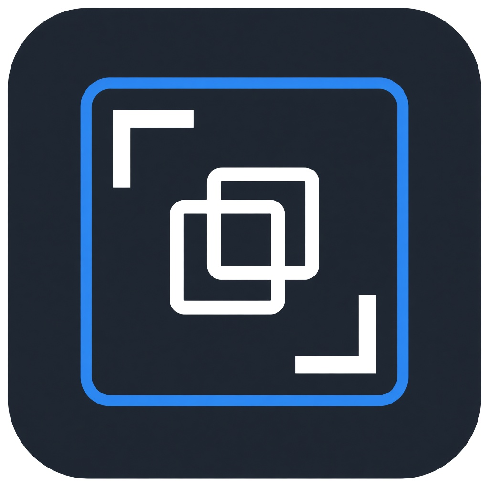
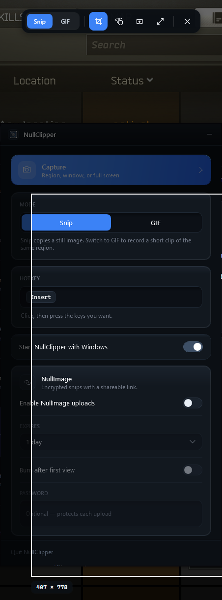
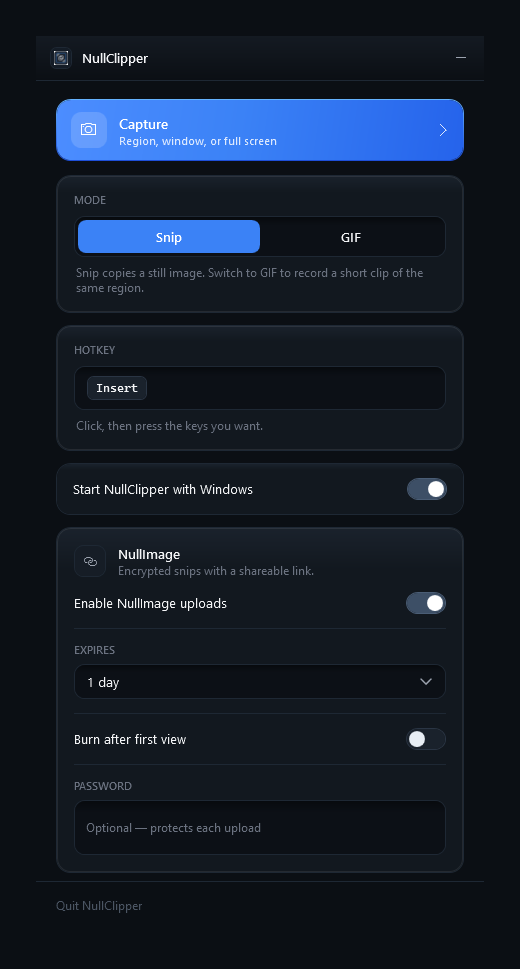
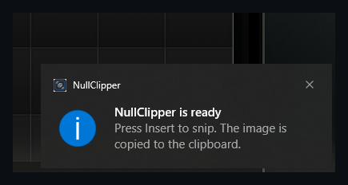
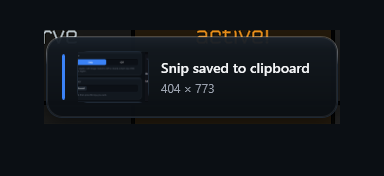

<p align="center">
  
</p>

<h1 align="center">NullClipper</h1>

<p align="center">
  <strong>A Windows snipping tool that lives in the tray.</strong><br>
  Draw a region, copy the image — or record a short GIF. Optionally upload an encrypted share link instead.
</p>

<p align="center">
  <a href="https://github.com/fleames/NullClipper/releases/latest"></a>
  <a href="LICENSE"></a>
  <a href="https://github.com/fleames/NullClipper/actions/workflows/ci.yml"></a>
  
</p>

<p align="center">
  <a href="https://github.com/fleames/NullClipper/releases/latest"><strong>Download NullClipper-win-x64.zip</strong></a>
  · Windows 10/11 x64 · requires <a href="https://dotnet.microsoft.com/download/dotnet/8.0">.NET 8 Desktop Runtime</a>
</p>

---

<p align="center">
  
</p>
<p align="center"><sub>Overlay toolbar: Snip or GIF, then rectangle, freeform, window, fullscreen. Esc cancels.</sub></p>

<p align="center">
  
  &nbsp;&nbsp;
  
</p>
<p align="center">
  
</p>

## Why this exists

Windows already has a snipping tool. NullClipper is the version that stays out of the way: one hotkey, a thin overlay, image on the clipboard, done. No editor, no cloud account, no Start-menu window you have to hunt for.

If you want to send the snip instead of pasting it, turn on **NullImage**. The upload is encrypted on your machine. The server never sees the pixels — only ciphertext — and the key lives in the link fragment.

## Features

- **Clipboard snips** — region, freeform, window, or the whole screen. PNG lands on the clipboard.
- **GIF capture** — record a region at 12 fps for up to 8 seconds. Longest side is capped at 640px so files stay small.
- **Click-to-record hotkey** — open Settings, click the hotkey field, press the keys you want. Default is `Ctrl + Shift + X`.
- **Tray app** — left-click the icon to capture, right-click for Settings / Exit. Settings hides to the tray (minimize, no title-bar close). Single-instance; a second launch just starts another snip.
- **Multi-monitor** — overlay on every display, freeze-frame so nothing moves while you drag.
- **Start with Windows** — optional Run-key registration.
- **NullImage (optional)** — encrypted share link instead of an image. Off unless you check the box.

## Install

1. Install the [.NET 8 Desktop Runtime](https://dotnet.microsoft.com/download/dotnet/8.0) for Windows x64 if you do not already have it.
2. Open the [latest GitHub Release](https://github.com/fleames/NullClipper/releases/latest).
3. Download **`NullClipper-win-x64.zip`**, extract it, and run **`NullClipper.exe`**.

The exe is a tray app. It will not keep a window open. Look for the scissors-and-link icon near the clock, or the “NullClipper is ready” balloon.

## Usage

| Action | What happens |
| --- | --- |
| `Ctrl + Shift + X` (or your hotkey) | Overlay appears over a frozen screenshot |
| Snip / GIF on the toolbar | Still image, or a short recording of the region |
| Drag | Rectangular (or freeform) selection |
| Click a window in window mode | Snips that window’s bounds |
| Fullscreen button | Whole monitor |
| `Esc` / right-click | Cancel |
| Left-click the tray icon | Same as the hotkey |

After a snip, a toast confirms **Snip saved to clipboard** (or that a NullImage link was copied), with a thumbnail of what you just grabbed. Paste into chat, an editor, anything that accepts an image. GIFs copy the same way.

### Settings

Right-click the tray icon → **Settings**. Minimize hides the window back to the tray.

- **Snip \| GIF** — still image, or record a short clip of the same region.
- **Capture / Record GIF** — fire a capture without the hotkey.
- **Hotkey** — click, then press a shortcut. Esc leaves the old one.
- **Start NullClipper with Windows** — logon launch.
- **Quit NullClipper** — leaves the tray.

## NullImage

NullImage is **optional**. NullClipper is a complete snipping tool with that checkbox off.

When it is on, each snip is encrypted with AES-256-GCM on the client (`ni1-aes-gcm-256`, same scheme as the [NullImage](https://nullimage.org) web app) and uploaded to `nullimage.org`. The clipboard gets a share URL with the key in the `#fragment`, so it never hits the server. You can set expiry (1 hour, 1 day, 3 days, or 7 days), burn-after-view, and an optional password.

If upload fails, NullClipper copies the image instead and tells you.

No API key. No account. Passwords you type in Settings are stored only in `%AppData%\Clipper\settings.json` on your PC — that file is not part of this repo.

## Build from source

Requires **.NET 8 SDK** on Windows.

```powershell
dotnet build Clipper.csproj -c Release
dotnet run --project Clipper.csproj -c Release
```

Framework-dependent publish (what the Release workflow ships):

```powershell
dotnet publish Clipper.csproj -c Release -r win-x64 --self-contained false `
  -o dist/win-x64
```

The output is a small folder (`NullClipper.exe` plus its DLLs). Zip that folder to match the GitHub Release asset. The published app needs the [.NET 8 Desktop Runtime](https://dotnet.microsoft.com/download/dotnet/8.0), not a bundled copy of .NET.

CI builds every push to `main`. Push a tag `v*` (for example `v1.1.0`) to cut a new GitHub Release with `NullClipper-win-x64.zip`.

## License

[MIT](LICENSE) © 2026 fleames
